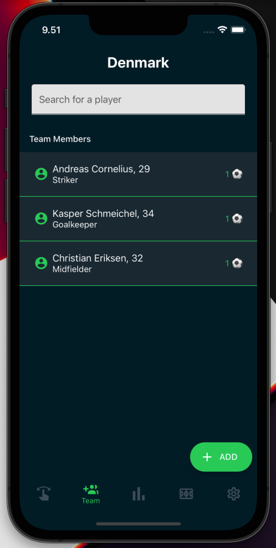

# Spirite

    A React Native Team Football App, with tinder swipeable feature to keep track of the teams players attendance.

**App Features**

- Create a Team.
- Add/Remove players to/from the team.
  - Each player has these attributes: Name, age, photo, and attendance stats.
  - Each player is editable after creation.
- Set a Lineup with the players.
- Choose between different formations (442, 451, 433, etc..).
- List of players are searchable.
- Dark mode / light Mode.

## Showcase of the app

 
 
 

# Expo Template Realm JavaScript

Simple Expo template to quickly get started with Realm.

## 🚀 How to use

If you haven't already, install the `expo-cli`:

```
npm install --global expo-cli
```

```
yarn global add expo-cli
```

Then use the following command to generate your template:

```
expo init MyAwesomeRealmApp --template @realm/expo-template-js
```

## 🏃 How to build and run locally

- [Setup development Environment](https://reactnative.dev/docs/environment-setup)
- Build/Run on iOS 🍎

```
yarn ios
```

```
npm run ios
```

- Build/Run on Android 🤖

```
yarn android
```

```
npm run android
```

## 💻 Start the Dev Client

```
expo start --dev-client
```

```
yarn start
```

```
npm run start
```

## 🔀 Setting up sync

See https://github.com/realm/realm-js/blob/master/templates/docs/sync-setup.md for instructions.

## ☁️ Build in the cloud

- [Building with EAS](https://docs.expo.dev/eas/)

## 📝 Notes

- [React Native docs](https://reactnative.dev/docs/getting-started)
- [React Hooks](https://reactjs.org/docs/hooks-intro.html)
- [Setting Up Realm Sync](https://docs.mongodb.com/realm/sdk/react-native/quick-start/)
- [Realm JS Documentation](https://docs.mongodb.com/realm/sdk/react-native/)
- [@realm/react Readme](https://github.com/realm/realm-js/tree/master/packages/realm-react#readme)
